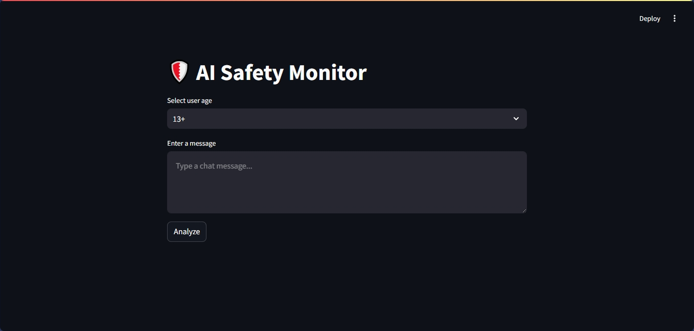
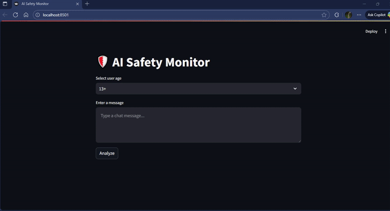

# AI Safety Monitoring System – Proof of Concept (POC)

A machine learning system for detecting abuse and crisis signals in text content. This is a proof of concept implementation of the system. 

## Web App Preview


## Project Setup

### Prerequisites
- Python 3.12 or higher 
- uv package manager

### Installation

1. Clone the repository:
```bash
git clone https://github.com/jcm-ai/ai_safety_monitoring.git
```
```bash
cd ai_safety_monitoring
```

2. Install using uv:
```bash
uv init
```
3. Create a virtual environment using uv command
```bash
uv venv
```
4. Activate the virtual environment
```bash
source .venv/Scripts/activate
```
5. Install dependencies
```bash
uv add -r requirements.txt
```
6. Run the app
```bash
streamlit run app.py
```

## Project Structure

```Bash
ai_safety_monitoring/
├── app.py
├── pyproject.toml
├── .python-version
├── .gitignore
├── README.md
├── requirements.txt
├── configs/
│   ├── preprocessing.yaml
│   ├── models.yaml
│   ├── policy.yaml
│   └── ui.yaml
├── data/
│   ├── raw/
│   │   ├── train.csv
│   │   ├── test.csv
│   │   ├── test_labels.csv
│   │   └── sample_submission.csv
│   └── processed/
├── src/
│   ├── __init__.py
│   ├── config_loader.py
│   ├── utils/
│   │   ├── __init__.py
│   │   ├── logger.py
│   │   └── metrics.py
│   ├── preprocessing/
│   │   ├── __init__.py
│   │   ├── language_detection.py
│   │   ├── text_normalization.py
│   │   └── pii_masking.py
│   ├── models/
│   │   ├── __init__.py
│   │   ├── abuse_detector.py
│   │   ├── crisis_detector.py
│   │   ├── escalation_tracker.py
│   │   └── content_filter.py
│   ├── policy_engine/
│   │   ├── __init__.py
│   │   └── policy_decision.py
│   └── orchestrator/
│       ├── __init__.py
│       └── inference_pipeline.py
├── tests/                          # Unit tests
│   ├── __init__.py
│   ├── test_preprocessing.py
│   ├── test_models.py
│   ├── test_policy_engine.py
│   └── test_orchestrator.py
├── scripts/                        # CLI tools for training, evaluation, and inference
│   ├── __init__.py
│   ├── run_inference.py
│   ├── evaluate_models.py
│   └── tune_thresholds.py
├── reports/                        # Evaluation reports and logs
│   ├── logs/
│   └── evaluation/
└── notebooks/                      # Optional: Protoyping

```

## Usage

### 1. Training Models
To train and save the abuse and crisis detection models:
```bash
python -m scripts.train_and_save_models --train data/raw/train.csv
```

### 2. Model Evaluation
To evaluate model performance on test data:
```bash
python -m scripts.evaluate_models --test data/raw/test.csv --test_labels data/raw/test_labels.csv
```

### 3. Threshold Tuning
To optimize model decision thresholds:
```bash
python -m scripts.tune_thresholds --train data/raw/train.csv
```

### 4. Running Inference
To perform inference on a single text input:
```bash
python -m scripts.run_inference --text "I will hurt you" --age "13+"
```

### 5. Running the Web Application
To launch the Streamlit web interface:
```bash
streamlit run app.py
```
The app will be available at `localhost:` e.g. http://localhost:8501

## Configuration

The system uses YAML configuration files located in the `configs/` directory:
- `models.yaml`: Model hyperparameters and architectures
- `policy.yaml`: Safety policy rules and thresholds
- `preprocessing.yaml`: Text preprocessing settings
- `ui.yaml`: Web interface configuration

## Project Components

1. **Abuse Detector**: Identifies harmful or abusive content
2. **Crisis Detector**: Detects signals of crisis or emergency situations
3. **Policy Engine**: Applies safety rules and generates appropriate responses
4. **Web Interface**: User-friendly interface for system interaction

## Testing

Run the test suite:
```bash
python -m pytest tests/
```

## Development

1. Create a new Python virtual environment
2. Install development dependencies
3. Follow coding standards (PEP 8)
4. Write tests for new features

## License

[MIT License](MIT License

Copyright (c) 2025 A Child Of God

Permission is hereby granted, free of charge, to any person obtaining a copy
of this software and associated documentation files (the "Software"), to deal
in the Software without restriction, including without limitation the rights
to use, copy, modify, merge, publish, distribute, sublicense, and/or sell
copies of the Software, and to permit persons to whom the Software is
furnished to do so, subject to the following conditions:

The above copyright notice and this permission notice shall be included in all
copies or substantial portions of the Software.

THE SOFTWARE IS PROVIDED "AS IS", WITHOUT WARRANTY OF ANY KIND, EXPRESS OR
IMPLIED, INCLUDING BUT NOT LIMITED TO THE WARRANTIES OF MERCHANTABILITY,
FITNESS FOR A PARTICULAR PURPOSE AND NONINFRINGEMENT. IN NO EVENT SHALL THE
AUTHORS OR COPYRIGHT HOLDERS BE LIABLE FOR ANY CLAIM, DAMAGES OR OTHER
LIABILITY, WHETHER IN AN ACTION OF CONTRACT, TORT OR OTHERWISE, ARISING FROM,
OUT OF OR IN CONNECTION WITH THE SOFTWARE OR THE USE OR OTHER DEALINGS IN THE
SOFTWARE.)

## Contact

[Jagadish](https://jcm-ai.github.io)